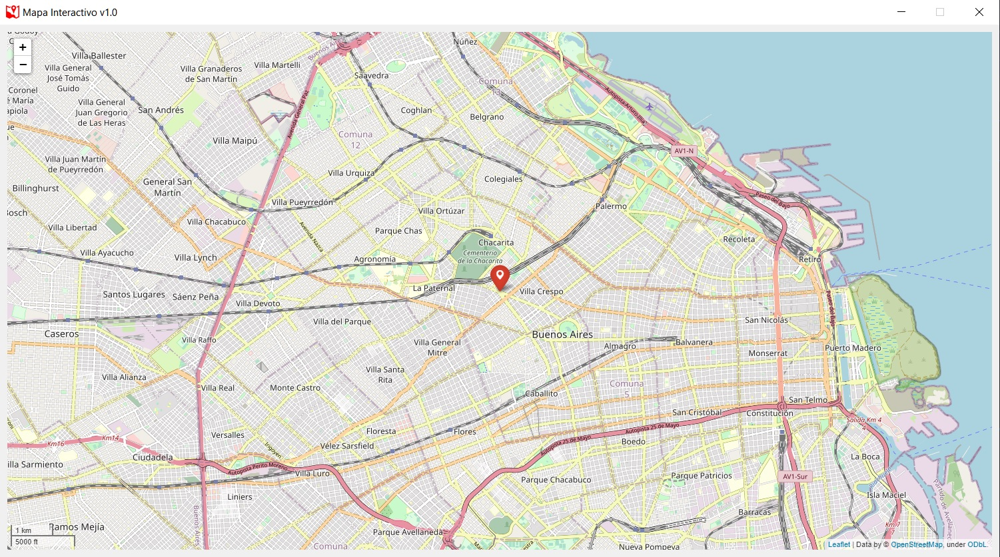
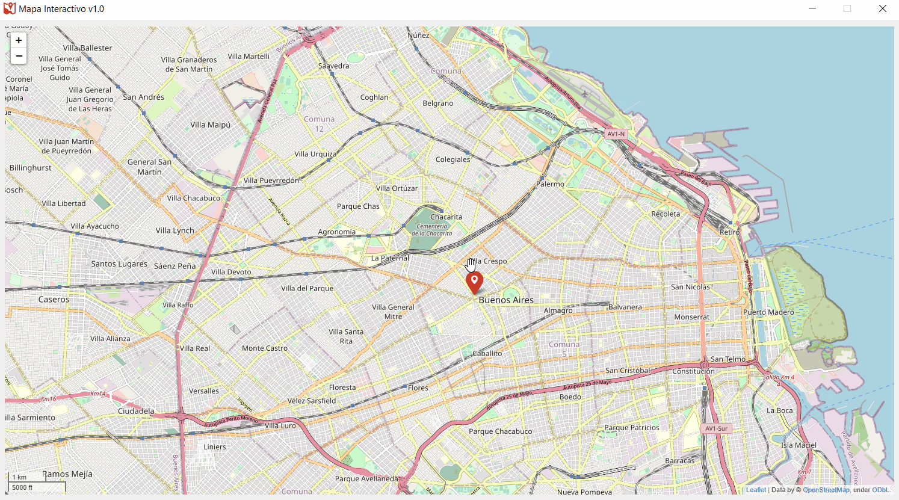
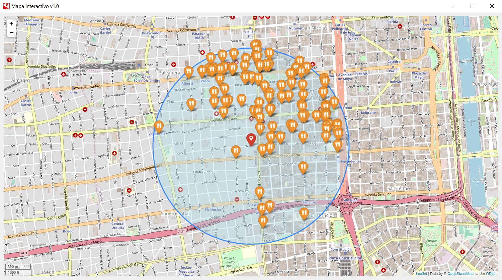

# Mapa  de la ciudad autonoma de Buenos Aires

.

El proyecto comprende dos aplicaciones construidas siguiendo el patrón de diseño MVC (Modelo-Vista-Controlador). Una de ellas es una aplicación de escritorio que actúa como servidor, mientras que la otra es una aplicación cliente que permite realizar consultas al servidor. La meta del proyecto es mostrar al usuario ubicaciones geográficas de interés dentro de la Ciudad Autónoma de Buenos Aires. Para alcanzar este objetivo, se utilizan bases de datos proporcionadas de manera pública por el Gobierno de la Ciudad de Buenos Aires. Las ubicaciones se muestran en una interfaz gráfica que incluye un mapa de la ciudad, junto con el nombre y la dirección de los lugares de interés seleccionados.

---

### Prerrequisitos  📋

* El proyecto fue desarrollado sobre [Python 3.9](https://www.python.org/downloads/release/python-390/) o superiores.
* Se utilizaron las siguientes librerias:
    - [PySide2](https://wiki.qt.io/Qt_for_Python) version 5.15.2 (ex-PyQT5)
    - [folium](https://python-visualization.github.io/folium/) version 0.12.1
    - [Jinja2](https://jinja.palletsprojects.com/en/3.0.x/) version 3.0.2
    - [pandas](https://pandas.pydata.org) version 1.3.4
    - [peewee](http://docs.peewee-orm.com/en/latest/) version 1.3.4
    
---

### Instalación 🔧

Procedemos a instalar los paquetes:

```
pip install PySide2
pip install folium
pip install Jinja2
pip install pandas
pip install peewee
```
---

## Ejecucion de servidor 🗄️

Ejecutamos un interprete de comandos, sobre Windows ejecutamos CMD, accedemos a la carpeta 'server' y ejecutamos el siguiente comando:

```
py server.py
```
Con esto logramos lanzar el servidor el cual queda esperando la conexion de un cliente.

---

## Ejecucion de cliente 👥

Antes de proceder a lanzar el cliente debemos asegurarnos de que haya un servidor escuchando, para lanzar el cliente debemos ,desde CMD, acceder a la carpeta 'client' y ejecutar el siguiente comando:

```
py controlador.py
```

Si todo funciona correctamente nos lanzara la siguiente interfaz grafica:



En el CMD lanzado nos pedira una direccion de correo valida al cual nos llegaran nuestras busquedas.

A continuacion nos dara dos opciones de busqueda:

    1) Por coordenadas
    2) Por barrios
    
1) Para conocer las coordenadas de una ubicación en concreto debemos arrastrar el marcador y clickear en él como se ve a continuación:



Una vez que tenemos las coordenadas las pegamos en el CMD y se nos habilitara un menu con opciones, por ejemplo aqui podemos ver todos los restaurantes cercanos a las coordenadas que le pasamos:



---
